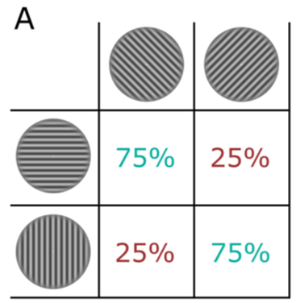

## 1 方法和设计

### 1.1 实验仪器与材料

实验程序采用MATLAB R2024b和Psychtoolbox 3.0.19编写，运行于一台装有Windows 11 专业版的计算机上，用于精确控制刺激的生成、呈现与实验流程，并记录被试的反应及反应时。视觉刺激呈现于16.1英寸的IPS液晶显示屏上（分辨率2440×1440像素,刷新率60Hz）。听觉刺激通过标准双声道耳机呈现（小米活塞耳机，产品型号为HSEJ02JY，频率响应范围为20-20000Hz，额定功率为5mW）。被试通过标准计算机键盘进行按键反应。

实验中使用的视觉刺激为Gabor光栅(Gabor gratings)，由Psychtoolbox程序实时在线生成。Gabor光栅的空间频率设定为0.7周/度 (cycles per degree)，视角大小为10度 (degrees of visual angle)。刺激呈现于灰色背景的中央。

按照种类可以分为领先刺激(Leading Stimulus)、跟随刺激(Trailing Stimulus)和捕获试次刺激(Catch Trial Stimulus)；其中领先刺激为垂直 (0°) 或水平 (90°) 方向的Gabor光栅；跟随刺激为顺时针 (45°) 或逆时针 (135°) 方向的Gabor光栅；捕获试次刺激为对比度显著降低的Gabor光栅 (具体对比度需预设为可被察觉但明显区别于标准刺激的水平，在实验中此类刺激的对比度为0.3，其余刺激的对比度为1.0)。

听觉刺激为纯音 (Pure tones)，由Psychtoolbox程序实时在线生成。纯音的采样率为44.1 kHz，通过耳机双耳同时呈现。

种类与视觉刺激一致：领先刺激为1000 Hz 或 1600 Hz 的纯音；跟随刺激为100 Hz 或 160 Hz 的纯音；捕获试次刺激为音量显著降低的纯音 (具体音量需预设为可被察觉但明显区别于标准刺激的水平，在实验中振幅系数为0.1，其余刺激为1.0)。

### 1.2 实验设计

本研究的核心设计在于构建并检验被试对模态内及跨模态刺激概率结构的内隐学习和外显知识。在内隐测试阶段 (Implicit Test Phase)主要采用一个2(注意模态: 视觉 vs. 听觉) × 2 (概率一致性: 高概率/预期 vs. 低概率/非预期)的被试内实验设计。

注意模态 (Attended Modality)为被试内变量，有两个水平：视觉注意任务和听觉注意任务。这通过在不同实验区块(Block)中指导被试注意特定模态的刺激（视觉光栅或听觉纯音）并完成相应辨别任务来实现。

概率一致性 (Probabilistic Congruency)为被试内变量，有两个水平：高概率转换（预期刺激对）和低概率转换（非预期刺激对）。这指的是在内隐测试阶段，呈现的领先刺激与跟随刺激之间的转换关系是否符合明确学习阶段建立的75%（高概率/预期）或25%（低概率/非预期）的统计规律。

在内隐测试阶段，主要因变量为被试在标准/偏差辨别任务中的表现，具体包括：

辨别准确率 (Discrimination Accuracy)，其操作定义为在每种注意模态和概率一致性条件下，被试正确判断跟随刺激为“标准”或“偏差”的比例。具体包括下面两个准确率：对预期刺激对下的目标刺激（标准或偏差）的辨别准确率，对非预期刺激对下的目标刺激（标准或偏差）的辨别准确率。

反应时 (Reaction Time, RT)，其操作定义为在每种注意模态和概率一致性条件下，被试对跟随刺激做出“标准”或“偏差”判断所花费的时间（从跟随刺激呈现开始至按键反应结束）。通常分析正确反应的平均反应时。具体包括下面两个反应时：对预期刺激对下的目标刺激进行正确判断的平均反应时，对非预期刺激对下的目标刺激进行正确判断的平均反应时。

阶梯法程序确定的偏差阈值 (Deviation Threshold determined by Staircase Procedure)，该指标对于视觉和听觉模态分别记录。该阈值反映了被试在特定模态下稳定达到约79.4%正确辨别率时，偏差刺激所需的最小物理偏差量（视觉为角度，听觉为赫兹）。此阈值本身可作为衡量知觉敏感性的一个指标，并用于确保不同被试和模态间的任务难度具有可比性。

此外，本研究还收集其他阶段的因变量作为辅助分析或学习效果的衡量。

在明确学习阶段 (Explicit Learning Phase)，实验收集判断准确率和反应时；其中判断准确率为被试对呈现的刺激对（领先刺激→跟随刺激）判断为“频繁”或“不频繁”的正确比例；反应时为被试做出“频繁”/“不频繁”判断所花费的时间。这些指标用以评估被试对模态内概率结构的初步外显学习效果。

在明确回忆阶段 (Explicit Recall Phase)，实验收集判断准确率，其操作性定义为：判断准确率为被试在实验结束后，对呈现的刺激对判断其在学习阶段属于“频繁”或“不频繁”的正确比例。此指标用以评估被试在完成内隐测试后，对概率结构所保持的外显记忆程度。

在捕获试次 (Catch Trials)中，实验收集报告率，其操作性定义为：在明确学习阶段和内隐测试阶段中，被试正确识别并报告“弱”刺激（低对比度视觉刺激或低音量听觉刺激）的比例。此指标用以监测被试的注意维持水平和任务依从性。

在每个模态（视觉和听觉）内部，领先刺激以固定的高概率（75%）预测一种特定的跟随刺激，以低概率（25%）预测另一种跟随刺激。这种概率关联通过预设的转移矩阵 (Transition Matrices) 实现（见图1）。

图1 转移矩阵示意图（Sabio-Albert et.al.,2025）

视觉刺激的转移概率与听觉刺激的转移概率在设计上是相互独立的（即正交的）。这意味着，某个特定的视觉领先刺激更可能跟随哪个视觉刺激，与同时呈现的听觉领先刺激更可能跟随哪个听觉刺激之间没有系统性关联。

为控制潜在的混淆变量，实验对不同条件进行了平衡。具体而言，对于每位被试，视觉和听觉刺激对之间的偶然组合（即所有可能的视觉-听觉领先刺激组合以及视觉-听觉跟随刺激组合）的出现次数是平衡的。此外，分配给不同被试的具体视觉和听觉转移矩阵组合也进行了平衡，在程序中通过被试的id对4取模得到的0、1、2、3来确定四种不同的转移矩阵组合方式。

### 1.3 实验程序

被试在实验开始前会阅读并签署知情同意书。主试将向被试详细解释实验的总体流程、各阶段的任务要求及按键操作。在必要时，会进行简要的视力、听力筛查，并协助被试将耳机音量调整至舒适水平。实验主要包含三个阶段：明确学习阶段、内隐测试阶段和明确回忆阶段。

#### 1.3.1 明确学习阶段 (Explicit Learning Phase)

设置明确学习阶段的目的是使被试明确学习并意识到在每个模态内部，领先刺激与跟随刺激之间的概率性关联（即哪种刺激转换更为频繁，哪种不频繁）。此阶段共包含4个区块 (Block)，每个区块40个试次 (Trial)，总计160个试次，预计持续约10分钟。区块类型在视觉和听觉任务间交替进行（例如，视觉区块-听觉区块-视觉区块-听觉区块）。

在视觉区块，指导语会明确告知被试需要关注视觉光栅对，并根据其判断的视觉刺激对的频繁程度进行反应。屏幕底部会显示一个“眼睛”图标作为当前任务模态的提示。

在听觉区块，指导语会明确告知被试需要关注听觉纯音对，并根据其判断的听觉刺激对的频繁程度进行反应。屏幕底部会显示一个“扬声器”图标作为提示。

在明确学习阶段，每个试次均按照以下固定时序展开：

首先，屏幕中央会呈现一个黑色注视点，该注视点将持续一段随机的时间（从750毫秒至1500毫秒，呈均匀分布），旨在引导被试将注意力集中于屏幕中心，并为即将出现的刺激做好准备。

注视点保持在屏幕中央，随后，视觉领先刺激（垂直0°或水平90°的Gabor光栅）与听觉领先刺激（1000Hz或1600Hz的纯音）将同时呈现，持续500毫秒。

领先刺激消失后，屏幕上将仅保留注视点，持续500毫秒。此间隔用于在时间上清晰分离领先刺激与后续的跟随刺激。

ISI结束后，视觉跟随刺激（顺时针45°或逆时针135°的Gabor光栅）与听觉跟随刺激（100Hz或160Hz的纯音）将再次同时呈现，同样持续500毫秒。

跟随刺激呈现完毕后，屏幕上将出现提示，要求被试进行判断。具体而言，屏幕会显示两个主要选项：“频繁 (frequent)”和“不频繁 (infrequent)”。被试的任务是根据当前区块指定的注意模态（视觉或听觉） ，回顾刚刚经历的该模态的刺激对（即从领先刺激到跟随刺激的转换），并判断这种转换是属于高概率（频繁）还是低概率（不频繁）的。对应的反应按键（例如‘Z’键和‘M’键）的功能（哪个代表“频繁”，哪个代表“不频繁”）会在每个区块开始时随机分配并明确告知被试。

若当前试次为捕获试次，即被注意模态的跟随刺激以较低强度（视觉对比度降低或听觉音量降低）呈现时，被试被要求忽略“频繁”/“不频繁”的判断，而是按下预先指定的“弱 (weak)”键（例如空格键）来报告对该低强度刺激的察觉。

反应屏幕将一直保持，直至被试完成按键反应，此阶段无时间限制，但会记录反应时。被试完成按键反应后，屏幕中央的注视点颜色将会改变，以提供即时反馈：若判断正确（或正确报告了“弱”刺激），注视点变为绿色；若判断错误，则变为红色。此反馈信息将持续一段预设时间（例如500毫秒），之后当前试次结束，自动进入下一个试次的准备与注视阶段。

区块间休息：每个包含40个试次的区块完成后，程序将提示被试可以进行短暂的休息，休息结束后由被试自行按键开始下一个区块。

图2 明确学习阶段单个试次的示意图（以视觉模态为例）

#### 1.3.2 内隐测试阶段 (Implicit Test Phase)

设置内隐测试阶段的目的是在被试执行一个与先前学习的概率结构无关的目标检测任务时，测量已学习的概率预期（即75%/25%的刺激转换规律）对目标刺激加工的内隐影响。此阶段为本研究数据分析的重点。此阶段共包含10个区块，每个区块72个试次，总计720个试次，预计持续约40分钟。区块类型同样在视觉和听觉任务间交替进行（5个视觉区块，5个听觉区块）。相应的提示图标（眼睛/扬声器）依然在屏幕底部显示。

被试的任务是区分当前注意模态的跟随刺激（目标刺激）是标准刺激还是发生了微小偏差的刺激 (Deviant Stimulus)。重要的是，在这一阶段，学习阶段建立的75%/25%概率关联与当前任务的正确判断标准无关，但刺激的呈现仍然遵循这些已学习的转移概率。与明确学习阶段的试次流程基本相同（注视点→领先刺激→ISI→跟随刺激），主要区别在于任务要求和部分跟随刺激的特性。

在每个区块中，约一半 (50%) 的试次中，被注意模态的跟随刺激会发生一个微小的、预设的偏差，在不同模态中偏差的定义如下：

视觉偏差指的是跟随Gabor光栅的方向会从其标准方向（45°或135°）偏离一个小角度；听觉偏差指的是跟随纯音的频率会从其标准频率（100Hz或160Hz）偏离一个小数值 (Hz)。

此阶段的反应屏幕与上一阶段不同：屏幕提示被试判断当前注意模态的跟随刺激是“偏差 (Deviant)”还是“标准 (Standard)”。需预先指定对应的反应按键（例如‘D’键和‘S’键）。同样提供“弱 (weak)”选项（空格键）用于报告捕获试次。每次反应后都提供视觉反馈（例如，绿色/红色注视点）。

在此阶段使用了两个独立的Staircase程序，其目的是为了使不同被试以及不同模态（视觉/听觉）下的偏差检测任务难度相对一致，使偏差检测的正确率大致维持在约79.4%的水平。一个程序用于视觉区块（调整视觉偏差的角度大小），另一个程序用于听觉区块（调整听觉偏差的频率差值）。

每个程序遵循“3下1上 (3-down-1-up)”规则。即：若被试连续3次正确检测到偏差刺激，则在下一次出现偏差刺激时减小其偏差量（任务变难）；若被试未能检测到偏差刺激（或错误地将标准刺激判断为偏差），则在下一次出现偏差刺激时增大其偏差量（任务变易）。

初始偏差量设定为视觉20°，听觉20Hz。偏差调整的步长会根据Staircase的反转次数（即调整方向发生改变的次数）动态减小，以便在接近个体阈值时进行更精细的调整，减少波动。

每个区块包含8个捕获试次（4个视觉，4个听觉），与明确学习阶段的设计和目的相同。

 

图3 内隐测试阶段单个试次的示意图（以视觉模态为例）

#### 1.3.3 明确回忆阶段 (Explicit Recall Phase)

设置该阶段的目的是测试被试在整个实验（尤其是内隐测试阶段）结束后，是否仍然保留了对学习阶段所学到的刺激对频率（概率关联）的明确记忆。此阶段共包含2个区块，每个区块分别针对一个模态（即1个视觉回忆区块，1个听觉回忆区块）。每个区块包含8个试次，总计16个试次，预计持续约2分钟。

在每个试次中，程序会呈现一个完整的刺激对（领先刺激+跟随刺激）。被试的任务是判断该刺激对在实验的早期（即明确学习阶段）是“频繁 (frequent)”出现的还是“不频繁 (infrequent)”出现的。在每个模态的回忆区块中，该模态内所有4种可能的刺激对（例如，视觉模态：0°→45°, 0°→135°, 90°→45°, 90°→135°）将各呈现2次。试次的呈现顺序是随机的。被试通过按键选择“频繁”或“不频繁”（提示词中给出对应的按键）。此阶段不设置捕获试次，也不提供反应后的反馈。

实验全部结束后，程序会显示感谢语，主试将对被试的参与表示感谢，并进行必要的实验解释（debriefing）。

## 2 结果

 暂无

## 参考文献

Sabio-Albert, M., Fuentemilla, L., & Pérez-Bellido, A. (2025). Anticipating multisensory environments: Evidence for a supra-modal predictive system. Cognition, 254, 105970.